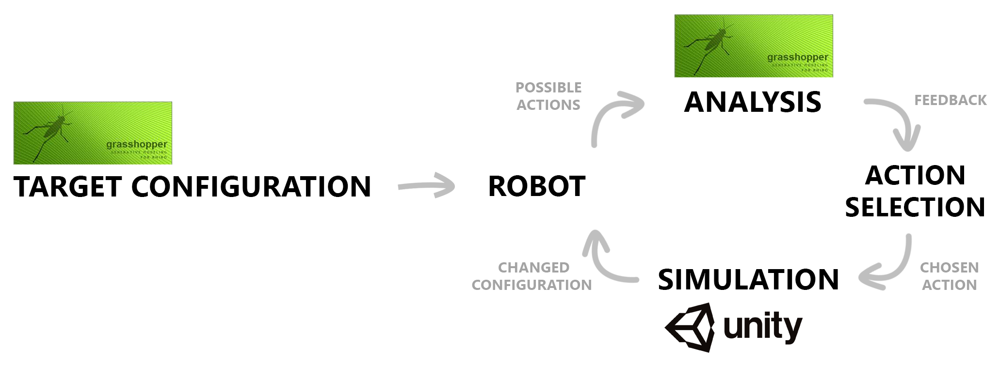
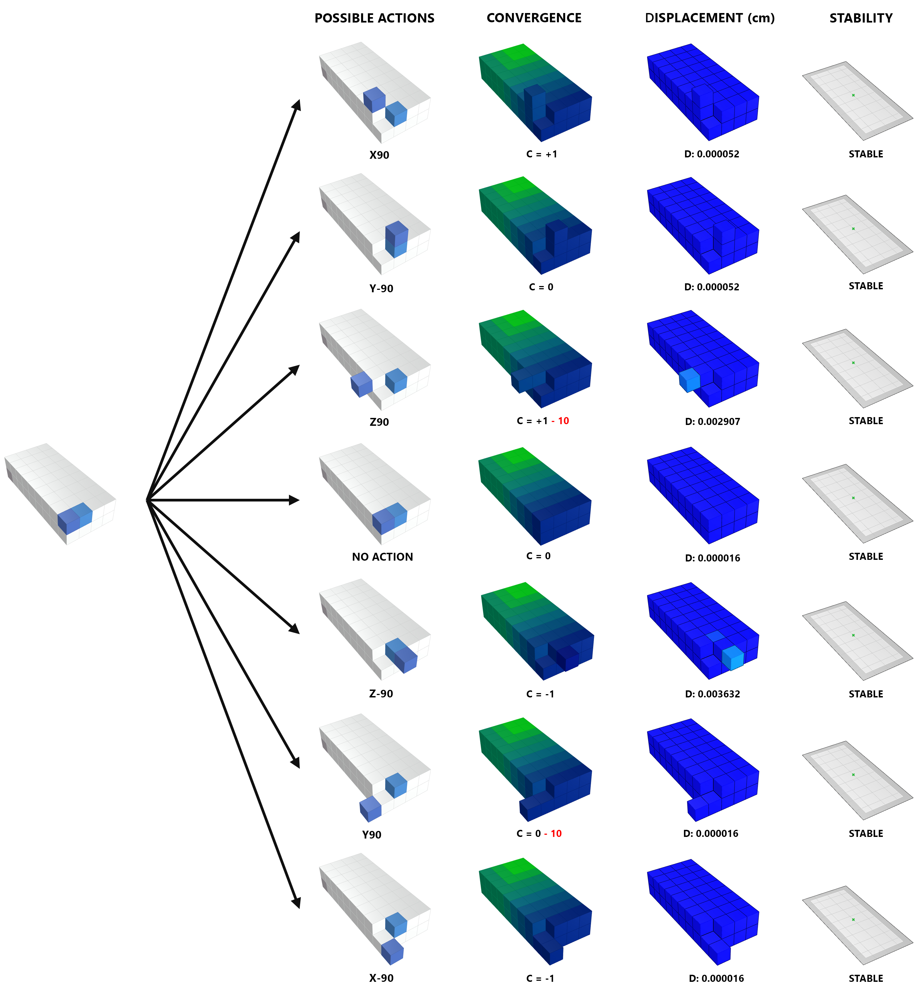
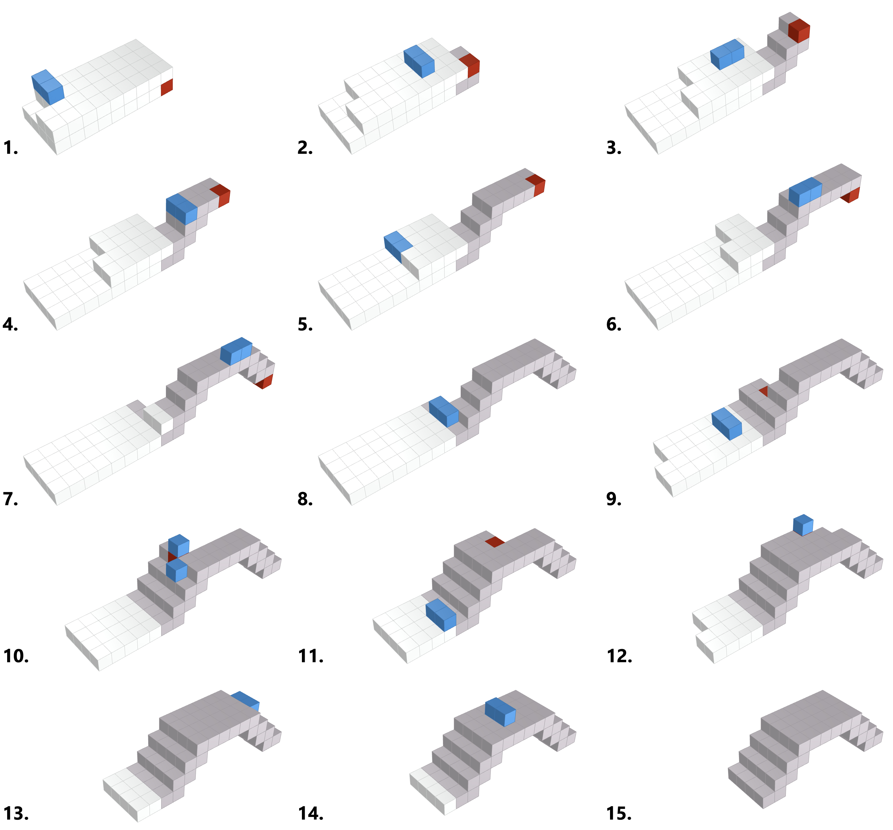

# Control system for structurally-driven self-reconfigurable robots

## 1. Context

This project was developed in the context of my dissertation to obtain a MSc. in Architectural Computation. This dissertation, entitled ”Structurally-driven Self-Reconfiguration: Towards Structurally-aware Assemblies of Modular Robots", addresses the structural requirements of building dynamic structures of modular robots and proposes a robust but adaptable structurally-driven control system for a self-reconfigurable robotic system, based on the structural analysis and performance of not only the final target configuration of a robotic assembly but also of the intermediate transitional configurations achieved during self-reconfiguration. The full thesis text can be found [here](https://sofia-feist.github.io/publications/Sofia_Feist_Thesis_Structurally-drivenSR.pdf).

## 2. Methodology

In order to simulate and analyse robotic behaviour, two different simulation environments were used: (1) <b>Unity 3D</b> to simulate the robot’s physical behaviour and validate stability calculations with rigid-body simulations, and (2) <b>Grasshopper</b> for structural analysis and optimization. These two environments were connected using a User Datagram Protocol (UDP) connection for real-time data exchange and to create a feedback loop for the self-reconfiguration process.  

  

 Figure 1 - Self-Reconfiguration Workflow between Unity and Grasshopper

From an initial configuration, the robotic system determines the possible actions based on the local configuration and sends the corresponding geometric data of the resulting configurations to Grasshopper for structural analysis. The feedback of each action is subsequently used in an action selection process that determines the next action the robot should take. This selection process is based on both the structural performance of the robotic configurations as well as convergence criteria towards the target configuration. Finally, the chosen action is executed and simulated in Unity, resulting in a changed configuration. This process is repeated until the target configuration is reached. This workflow, illustrated in Figure 1, allowed us to drive the self-reconfiguration decision-making process based on structural feedback.

## 3. Implementation

### Target Shape Optimization

Before starting the reconfiguration process, we need to make sure that the target configuration itself is structurally feasible and stable, otherwise the assembly might never be able to converge into it. To obtain a structurally feasible and optimized target shape, we perform a topology optimization using the tOpos plug-in for Grasshopper to find the optimal solid-void pattern of material distribution of a given shape. Once a target shape is found, each module is given a representation of this shape in the form of a list of goal cell coordinates.

### Module Design and Motion Control

   

 Figure 2 - Example of a module motion

The developed modular robotic system considers modules with 3 rotational Degrees of Freedom that allow modules to perform ± 90º degree rotations around their center. Since modules have no autonomy of movement, they have to be carried by a neighbouring module, also known as the Pivot, in a rotating motion. Moreover, to support the pivot’s rotating motion, at least one Support module is needed to fix the pivot’s axis of rotation. 

To make the robotic system more scalable, we use a distributed strategy of motion control based on local rules for the modules. A rule consists of a possible action that a module can take based on a specific local neighbourhood. Depending on the existence and distribution of other modules in this neighborhood, several actions are possible. In order to be executable, these actions need to comply with the modules’ motion constraints.

### Action Analysis and Fitness

Each module action results in a different configuration. If more than one rule applies, all of those possible configurations will have different corresponding fitnesses. We evaluate the fitness of each action based on three fitness criteria: (1) convergence towards the given target configuration, (2) stability of the overall assembly, or (3) the structural performance of the assembly.

  

 Figure 3 - Possible module actions and corresponding fitnesses

### Action Selection

Because we have three fitness criteria that modules need to consider when choosing an action, choosing which fitness to prioritize depends on the calculated values of the different fitnesses and whether they fall within their respective thresholds. Actions that maximize convergence are preferable for a quicker and more efficient self-reconfiguration process. However, always seeking the most convergent actions can cause the structure to break or become unstable if no structural factors are considered. In those cases, convergence must be sacrificed for a safer and more stable assembly. This is done through the thresholds. An action that maximizes convergence and falls under the stability and nodal displacement thresholds will always be preferred. If that is not possible, actions that fall over the safety threshold are still allowed but require an immediate corrective action to counterbalance the loss of performance. Actions considered unstable or dangerous for structural performance are disregarded altogether. 

## 4. Results

Examples of the resulting reconfiguration sequence can be found in the image below (Figure 4) and in the video [here](https://sofia-feist.github.io/SRrobots.html).

  

 Figure 4 - Reconfiguration sequence according to Convergence and Stability

## 5. Important Links

* [Feist, S. (2020) Structurally-driven Self-Reconfiguration: Towards Structurally-aware Assemblies of Modular Robots, M.Sc, University College of London.]( https://sofia-feist.github.io/publications/Sofia_Feist_Thesis_Structurally-drivenSR.pdf)

* [Dissertation Video](https://sofia-feist.github.io/SRrobots.html)
